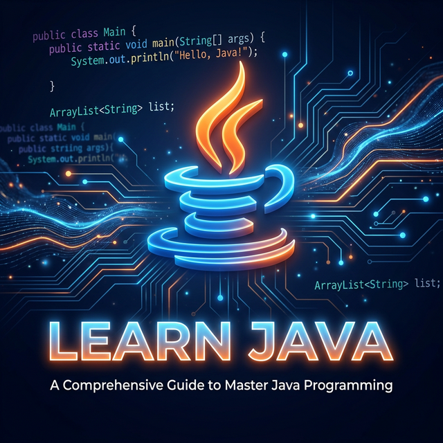

<div align="center">
  
  <br/>
  <h1>✨ LEARN JAVA ✨</h1>
  <p><i>A Premium Collection of Fundamental Java Concepts & Logic</i></p>
  
  
  
  
  <br/>
  
</div>

<hr/>

## 🚀 Overview

Welcome to **Learn Java**! This repository is designed as a clean, structured environment for mastering Java fundamentals. From basic data manipulations to mathematical logic, each file is a building block for advanced software engineering.

<div align="center">
  
  <p><i>Visualizing Logic Flow and Data Structures</i></p>
</div>

---

## 📂 Project Structure & Core Logic

### 🧮 Mathematical & Logic Operations
- **`sum.java`** | *Basic Addition*
  - Implementation of simple binary operations.
- **`ArraySum.java`** | *Iterative Summation*
  - Techniques for traversing and aggregating data within arrays.
- **`Division.java`** | *Precision Logic*
  - Handling quotients and remainders with boundary edge cases.

### 🔍 Data Analysis & Processing
- **`MaxNumbArray.java`** | *Optimization Algorithms*
  - Finding the maximum value using iterative comparison patterns.
- **`productinputs.java`** | *Dynamic Input Handling*
  - Real-world simulation of product data entry and processing.

### 🖥️ Display & Output
- **`HelloWorld.java`** | *Syntax Entry*
  - The architectural foundation of all Java applications.
- **`Printing.java`** | *Console UX*
  - Advanced string formatting and standard output streams.

---

## 🛠️ Execution Guide

### 1. Compile
Transform your source code into bytecode effortlessly:
```bash
javac FileName.java
```

### 2. Run
Execute the compiled class in the Java Virtual Machine:
```bash
java FileName
```

## ⚙️ CI/CD Workflows

This repository is equipped with **GitHub Actions** to automate the development lifecycle:
- **Automated Compilation**: Every push to the `main` branch triggers a workflow that automatically compiles all Java files to ensure code integrity.
- **Manual Trigger**: You can manually trigger a compilation run at any time from the **Actions** tab on GitHub.
- **Continuous Integration**: Instant feedback on whether your latest changes are syntactically correct and ready for execution.

### 🖱️ How to Compile on GitHub
Want to compile your code manually?
1. Go to the **Actions** tab in your repository.
2. Select **Java Compilation CI** from the left sidebar.
3. Click the **Run workflow** dropdown button.
4. Click the green **Run workflow** button to start the compilation.

---

<div align="center">
  <h3>👨‍💻 Lead Developer</h3>
  <p><b>Binyaamin</b></p>
  <a href="mailto:binyaaminofficial@gmail.com">
    
  </a>
  <a href="https://github.com/binyaaminofficial">
    
  </a>
</div>

<hr/>

<div align="center">
  <p><i>Designed with ❤️ for modern Java enthusiasts.</i></p>
</div>
